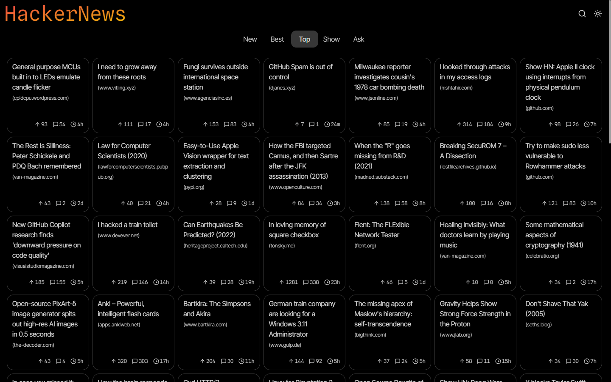
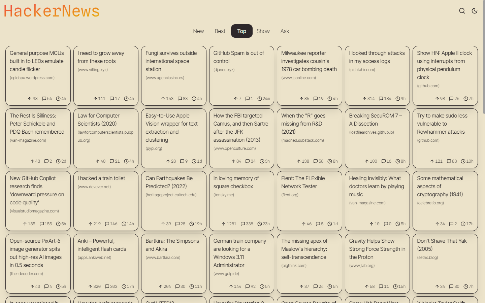
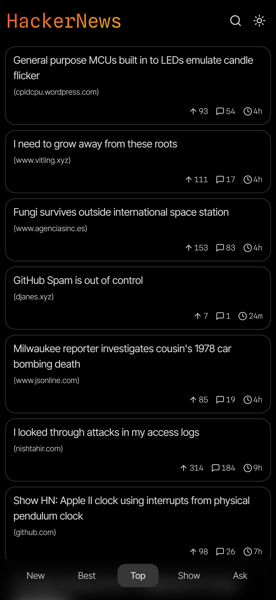
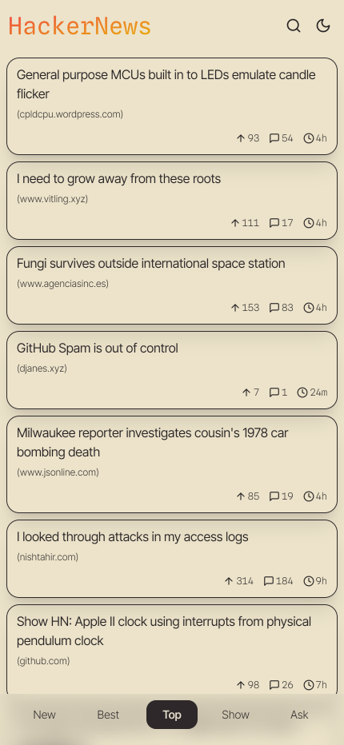

# Hacker News Reader App

Opinionated build of HackerNews front end. 

## Screenshots

## Features

- Grid view to make use of larger screens.
- Infinite scroll for feeds.
- Links in posts open in new tab.
- Dark & light theme available.
- Hit box easier to click on mobile.
- View top 50 root comments only by default, click to expand individual commments. 
- Installable as PWA. 

## Stack

- SvelteKit 2.0 & Svelte 4.
- [Daisy UI](https://daisyui.com/) and TailwindCSS for styling. 
- [Lucide](https://lucide.dev/) for icons
- Using Firebase JS SDK on the server to query the official [HackerNews API](https://github.com/HackerNews/API). A web socket is shipped to client for rendering. No SSR. 
- [Algolia Search API](https://hn.algolia.com/api) to search.
